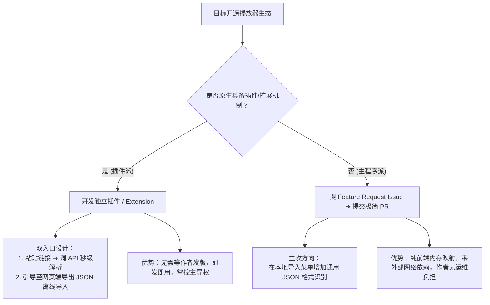

# 🎵 PlaylistOut 开源生态接入与第三方播放器集成战略规划 (Ecosystem Integration Plan)

> **文档状态**：规划与实施中 (Active Planning & Execution)  
> **核心目标**：将 PlaylistOut 沉淀的国内主流音乐平台（QQ 音乐、网易云音乐、酷狗音乐、汽水音乐）歌单全量解析能力，以**“插件扩展（即发即用）”**与**“主程序轻量适配 PR（纯本地无依赖）”**双轨模式，全面赋能主流开源音乐播放器生态。

---

## 1. 背景与愿景 (Background & Mission)

### 1.1 现状与用户痛点
开源音乐播放器（如 MusicFree、洛雪音乐 LX Music、BBPlayer、Listen 1 等）凭借清爽无广告、跨平台、支持自定义音源等特性，吸引了大量追求听歌自由的用户。然而，用户从国内商业平台转向开源播放器时，普遍面临严重的**“歌单迁移壁垒”**：
1. **反爬与风控频发**：上游平台接口频繁改动，第三方散装爬虫经常失效（报 403、签名校验失败等）。
2. **截断与深度翻页限制**：未登录状态下，官方接口通常强制截断（如网易云仅返回 10~20 首），导致千首大歌单严重残缺。
3. **平台孤岛化**：汽水音乐等短链平台缺乏通用解析；酷狗音乐非公开歌单缺乏合规的安全授权机制。
4. **私有格式碎片化**：各大开源播放器大多各自定义了一套私有备份 JSON 格式，彼此互不兼容，用户难以在不同工具间流转。

### 1.2 PlaylistOut 的生态定位
PlaylistOut（把你的歌单带走）已建立成熟的**全量、免登录、支持千首自动翻页的跨平台歌单元数据解析与清洗引擎**，并提供标准化 JSON、CSV、Excel、M3U8 导出及高可用 Public API。Web 导出字段与兼容性约定统一维护在 [Web 导出格式规范](EXPORT-FORMATS.md)，JSON 的完整数据契约维护在 [JSON Schema](JSON-SCHEMA.md)。

本规划旨在**不重复造轮子**的前提下，作为各大开源播放器的**“外部歌单输入基础设施”**，帮助开源播放器用户一键搬家。

---

## 2. 核心战略：“插件派” vs “主程序派” 双轨制

经过对各大开源项目的架构审视，我们确立了明确的“分类攻坚”战略：

---

## 3. 目标开源平台深度画像与对症接入方案

### 3.1 第一梯队（核心突破口 ⭐⭐⭐⭐⭐）

#### 1. MusicFree (`maotoumao/MusicFree` / `MusicFreeDesktop`)
- **平台属性**：**插件派（首选主攻）**
- **技术栈**：React Native (移动端) / Electron (桌面端)
- **源码机制深度拆解**：
  - 核心模块 `core/musicSheet` 内部仅处理自身状态持久化。
  - 原生提供标准的插件扩展系统（CommonJS 规范），通过插件暴露 `importMusicSheet(urlLike)` 异步函数实现外部歌单导入，返回结构化 `{ title, id, artwork, musicList: [...] }`。
- **痛点诊断**：社区第三方插件质量良莠不齐，QQ/网易大歌单解析频繁报错截断，汽水音乐完全无插件可用。
- **落地方案**：
  1. **【即发即用】开发独立插件 `musicfree-plugin-playlistout`**：
     - 在插件中调用 `GET https://playlistout-api.lengxiqwq.com/api/v1/resolve?q=<url>`。
     - 一站式支持 QQ音乐、网易云（无损千首）、酷狗、汽水音乐所有链接与短链。
     - 双入口设计：输入框粘贴链接秒级解析；插件提示信息引导访问网页端进行批量备份。
  2. **【主程序增强】提交 Issue / PR**：
     - 建议作者在主程序的“导入本地歌单”功能中，增加对本地标准 JSON 歌单文件的读取支持。

---

#### 2. 洛雪音乐助手 (LX Music) (`lyswhut/lx-music-desktop`)
- **平台属性**：**主程序派（影响力最大，40k+ Stars）**
- **技术栈**：Electron + Vue 3
- **源码机制深度拆解**：
  - 洛雪的“自定义源”机制专用于**搜索和音频流检索**，不负责歌单管理。
  - 歌单管理位于主程序，支持“打开歌单链接”（易受风控）和“我的列表 - 导入列表”（支持 `.json` 备份）。
  - 其私有 JSON 格式具有较强约束（包裹在 `data.userList` 中，曲目字段必须为 `name`, `singer`, `albumName`, `source` 等）。
- **痛点诊断**：用户无法直接导入外部通用的歌单文件；原厂链接经常因平台反爬无法完整加载。
- **落地方案**：
  - **提 Issue ➜ 提交极简 PR（主攻本地文件导入兼容）**：
  - 在洛雪本地读取 JSON 文件的解析函数中增加一个轻量兼容分支：
    若检测到传入数据包含 `tracks` 数组（即标准 PlaylistOut 结构），自动映射为洛雪内部的 `userList` 曲目对象。
  - **原则**：纯客户端本地转换，零网络开销，改动量 < 30 行，保证作者审核无顾虑。

---

#### 3. BBPlayer (B站音乐播放器) (`bbplayer-app/BBPlayer`)
- **平台属性**：**主程序派（最契合的应用场景 ⭐⭐⭐⭐⭐）**
- **技术栈**：React Native (Expo)
- **源码机制深度拆解**：
  - 其核心特色是：**“导入外部歌单 ➜ 自动在 B 站全站检索匹配原唱/翻唱/视频音源播放”**。
  - 目前应用内自行编写了针对网易云和 QQ 音乐的简易爬虫，代码耦合在主程序内。
- **痛点诊断**：自身维护外部音乐平台的爬虫极其吃力，经常失效；且不支持酷狗与汽水音乐。
- **落地方案**：
  - **提 Issue 沟通合作**：
    - 方案 A（首选）：在导入歌单面板增加“选择本地 JSON 文件”入口，读取由 PlaylistOut 导出的标准 JSON。
    - 方案 B（可选）：提供直接调用 PlaylistOut API 解析公共歌单的选项，帮助 BBPlayer 一劳永逸解决上游平台反爬维护难题。

---

### 3.2 第二梯队（重要拓展与生态补充 ⭐⭐⭐）

#### 4. Listen 1 (`listen1/listen1_desktop` / `listen1_chrome_extension`)
- **平台属性**：**主程序派**
- **技术栈**：Vue + Electron / Chrome Extension
- **源码机制深度拆解**：
  - 采用独有的 `listen1_backup.json` 备份字典，必须以 `myplaylist_[UUID]` 作为对象键名。
- **落地方案**：
  - 提交 Issue / PR：在 `import_data` 恢复函数中，若传入格式不是 `myplaylist_` 字典，而是标准 `{ name, tracks }`，自动封装为 Listen 1 内部结构写入本地存储。

---

#### 5. Moosync (`Moosync/Moosync` / 4k+ Stars)
- **平台属性**：**插件派**
- **技术栈**：Electron + TypeScript
- **源码机制深度拆解**：
  - 拥有完善的 Extension SDK（`@moosync/moosync-types`），原生支持监听 `api.on('requestedPlaylistFromURL')` 并调用 `api.addPlaylist()`。
- **落地方案**：
  - 为其编写专门的 Moosync 扩展插件，发布至其扩展中心。

---

### 3.3 观察与跟踪梯队 (Watchlist)

| 平台 | 属性 | 当前现状与策略 |
| :--- | :--- | :--- |
| **Spotube** (`KRTirtho/Spotube`) | 海外 Flutter 播放器 | 严格依附 Spotify 账号体系，目前完全没有本地歌单文件导入功能。Issue 区需求众多，跟踪其架构动向，作为中长期功能提案。 |
| **YesPlayMusic** (`qier222/YesPlayMusic`) | 网易云第三方客户端 | 严格绑定网易云账号体系，无独立本地列表设计，暂不建议强行侵入。 |

---

## 4. 跨平台数据规范与字段映射矩阵 (Field Mapping Matrix)

在编写插件与提交适配 PR 时，统一采用以下轻量字段映射标准：

| PlaylistOut 标准字段 | 含义 | MusicFree 目标字段 | LX Music 目标字段 | Listen 1 目标字段 |
| :--- | :--- | :--- | :--- | :--- |
| `title` | 歌曲名称 | `title` | `name` | `title` |
| `artists` | 歌手合并字符串 | `artist` | `singer` | `artist` |
| `album` | 专辑名称 | `album` | `albumName` | `album` |
| `durationMs` | 歌曲时长 (毫秒) | `duration` (秒) | `interval` (分:秒) | `—` |
| `coverUrl` | 封面图地址 | `artwork` | `img` | `img_url` |
| `id` / `sourceUrl` | 原始标识 / 原网页 | `id` | `songmid` / `id` | `id` / `source_url` |

---

## 5. 开源合规、隐私安全与免责声明

在与各开源项目作者沟通与提 PR 时，必须严格恪守以下原则：

1. **绝对不碰音源（零侵权风险）**：
   - PlaylistOut 仅解析和传递公开歌单的**文字元数据（歌名、歌手、专辑）**，绝不提取、存储或代理任何未授权音频流文件。
   - 所有播放音源均由目标播放器自身的音源插件或用户自建源完成匹配。
2. **零隐私追踪**：
   - 本地 JSON 文件导入 100% 在用户本地设备运行，无需网络请求。
   - Public API 采用纯无状态设计，绝不存储任何用户歌单与曲目历史。
3. **高可用保障**：
   - 生产 API 全链路部署于 Cloudflare 边缘计算节点，内置单 IP 30次/分钟的防刷限频，免费计划支持每日 100,000 次请求，具备充足的冗余度。

---

## 6. 实施路线图与执行排期 (Action Plan)

- [x] **Phase 1: MusicFree 官方插件研发与交付（已完成）**
  - 在 [`plugins/musicfree`](../plugins/musicfree/README.md) 中完整实现 `musicfree-plugin-playlistout`，通过 12 项全绿自动化测试套件。
  - 聚焦**双核心入口**（云端 API 在线万能解析 + 本地 .json 文件路径直接极速导入），彻底移除单曲冗余逻辑并拦截直接粘贴长文本，专注歌单迁移基础设施。
  - 构建产物同步托管至官方分发节点：`https://playlistout.lengxiqwq.com/plugins/把你的歌单带走-PlaylistOut.js`，国内用户一键极速安装。
- [x] **Phase 2: 洛雪音乐 (LX Music)、BBPlayer 与 Listen 1 官方 Issue 正式发起（已完成）**
  - **洛雪音乐 (LX Music)**: 已提交 [#3001](https://github.com/lyswhut/lx-music-desktop/issues/3001) - 建议在“导入列表”中支持自动兼容通用歌单 JSON 结构（附轻量 PR 方案）。
  - **BBPlayer**: 已提交 [#340](https://github.com/bbplayer-app/BBPlayer/issues/340) - 建议支持通过本地 JSON 文件直接导入歌单进行 B 站音源匹配（附 PR 意向）。
  - **Listen 1**: 已提交 [#1413](https://github.com/listen1/listen1_desktop/issues/1413) - 建议在歌单导入/恢复功能中向下兼容通用歌单 JSON 格式（附 PR 意向）。
- [ ] **Phase 3: 静待作者反馈并提交轻量 PR**
  - 根据各平台维护者反馈，提交 20~40 行极简、零侵入的本地 JSON 导入兼容 PR。
- [ ] **Phase 4: Moosync 扩展接入**
  - 为 Moosync 基于官方 Extension SDK 编写并上架导入扩展。
- [ ] **Phase 5: 建立跨生态兼容性持续集成验证**
  - 在 CI 流程中建立对标准 JSON 格式向前兼容的自动化断言，确保导出的 JSON 永远满足生态导入规范。
